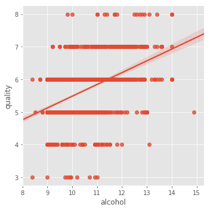

# Statistical Visualizations in Python and Seaborn - Lab

## Introduction

In this lab, we shall put the skills learnt around statistical visualizations in previous two lessons into practice. We shall work with a real-world dataset called **"The Wine Dataset"**, available at [UCI's machine learning repository](https://archive.ics.uci.edu/ml/datasets/wine). The original dataset is results of a chemical analysis of wines grown in Italy but derived from three different plants. The analysis determined the quantities of 13 constituents found in each of the three types of wines. 

We shall use a subset of data focusing at Red Wine contituents and quality only for this lab. A detailed description of included features can be viewed at [Kaggle](https://www.kaggle.com/piyushgoyal443/red-wine-dataset/home).

Let's first import the necessary libraries we would need for loading the data and visualizations.


```python
# Import necessary libraries
import warnings
warnings.filterwarnings("ignore")

import pandas as pd
import numpy as np
from matplotlib import pyplot as plt
%matplotlib inline

import seaborn as sns
plt.style.use('ggplot')
```

The dataset is available in your folder as `winequality-red.csv`. Let's first load this dataset into a pandas dataframe and view the head.


```python
# Read dataset
wine = pd.read_csv('winequality-red.csv')
# Display first 5 observations
wine.head()

# fixed acidity	volatile acidity	citric acid	residual sugar	chlorides	free sulfur dioxide	total sulfur dioxide	density	pH	sulphates	alcohol	quality
# 0	7.4	0.70	0.00	1.9	0.076	11.0	34.0	0.9978	3.51	0.56	9.4	5
# 1	7.8	0.88	0.00	2.6	0.098	25.0	67.0	0.9968	3.20	0.68	9.8	5
# 2	7.8	0.76	0.04	2.3	0.092	15.0	54.0	0.9970	3.26	0.65	9.8	5
# 3	11.2	0.28	0.56	1.9	0.075	17.0	60.0	0.9980	3.16	0.58	9.8	6
# 4	7.4	0.70	0.00	1.9	0.076	11.0	34.0	0.9978	3.51	0.56	9.4	
```


<div>
<style scoped>
    .dataframe tbody tr th:only-of-type {
        vertical-align: middle;
    }

    .dataframe tbody tr th {
        vertical-align: top;
    }

    .dataframe thead th {
        text-align: right;
    }
</style>
<table border="1" class="dataframe">
  <thead>
    <tr style="text-align: right;">
      <th></th>
      <th>fixed acidity</th>
      <th>volatile acidity</th>
      <th>citric acid</th>
      <th>residual sugar</th>
      <th>chlorides</th>
      <th>free sulfur dioxide</th>
      <th>total sulfur dioxide</th>
      <th>density</th>
      <th>pH</th>
      <th>sulphates</th>
      <th>alcohol</th>
      <th>quality</th>
    </tr>
  </thead>
  <tbody>
    <tr>
      <th>0</th>
      <td>7.4</td>
      <td>0.70</td>
      <td>0.00</td>
      <td>1.9</td>
      <td>0.076</td>
      <td>11.0</td>
      <td>34.0</td>
      <td>0.9978</td>
      <td>3.51</td>
      <td>0.56</td>
      <td>9.4</td>
      <td>5</td>
    </tr>
    <tr>
      <th>1</th>
      <td>7.8</td>
      <td>0.88</td>
      <td>0.00</td>
      <td>2.6</td>
      <td>0.098</td>
      <td>25.0</td>
      <td>67.0</td>
      <td>0.9968</td>
      <td>3.20</td>
      <td>0.68</td>
      <td>9.8</td>
      <td>5</td>
    </tr>
    <tr>
      <th>2</th>
      <td>7.8</td>
      <td>0.76</td>
      <td>0.04</td>
      <td>2.3</td>
      <td>0.092</td>
      <td>15.0</td>
      <td>54.0</td>
      <td>0.9970</td>
      <td>3.26</td>
      <td>0.65</td>
      <td>9.8</td>
      <td>5</td>
    </tr>
    <tr>
      <th>3</th>
      <td>11.2</td>
      <td>0.28</td>
      <td>0.56</td>
      <td>1.9</td>
      <td>0.075</td>
      <td>17.0</td>
      <td>60.0</td>
      <td>0.9980</td>
      <td>3.16</td>
      <td>0.58</td>
      <td>9.8</td>
      <td>6</td>
    </tr>
    <tr>
      <th>4</th>
      <td>7.4</td>
      <td>0.70</td>
      <td>0.00</td>
      <td>1.9</td>
      <td>0.076</td>
      <td>11.0</td>
      <td>34.0</td>
      <td>0.9978</td>
      <td>3.51</td>
      <td>0.56</td>
      <td>9.4</td>
      <td>5</td>
    </tr>
  </tbody>
</table>
</div>


Okie, this gives us an idea about features in the dataset. Except for the wine quality, which is a categorical variables, all other features are real valued. 

As a first step, let's plot a bar graph to show frequency of each class in the `quality`. For this, we need to count the number occurances of each class in the quality variable and plot the class-frequency bar chart.


```python
# In the quality variable, count the number of occurances for each class. 
# Create two lists: a) class labels , b) class frequency
# Use pandas value_counts()

count = wine.quality.value_counts()
keys =[]
for key in count.keys():
    keys.append(key)
keys, count.values
    
```


    ([5, 6, 7, 4, 8, 3], array([681, 638, 199,  53,  18,  10]))


Now we can use the two lists above for x and y axes of the bar graph where classes appear on x-axis and frequency of classes appear on y-axis.


```python
# Create a new figure object
fig = plt.figure(figsize = (7,5))

# Create an axes 
ax = fig.add_subplot(111)

# Plot vertical bars of fixed width by passing x and y values to .bar() function 
ax.bar(keys, count.values)

# Give a title to the bar graph
plt.title('Red Wine Quality')
plt.xlabel('Quality')
plt.ylabel('Class frequency')

# Output the final plot
plt.show()
```


So we can see that most of the observations in the dataset are for quality class 5 and 6 , i.e. average quality. We can not see any observations with quality class 1 or 2 (worst), and 9 (best) quality. 

Let's reduce the number of classes from 10 (1,2,--,10) to 3 (Good, Average and Poor) as that might give us a better indication of the contents of this dataset. For this, we shall create a new discreet, categorical response feature ('rating') from existing 'quality' variable using following criteria:
* poor: 1-4
* average: 5-6
* good: 7-10

There are number of ways we can achieve this. Let's try following steps:
1. Define a variable `condition` containing boolean values for good and poor quality wine.
* Add a new variable `rating` to the dataset by identifying good and poor quality wines using `condition` from step 1. Set 'average' as default while using `np.select()` to achieve this. 
* count the values for each class in the new column. 


```python
condition = [(wine['quality'] >= 7),(wine['quality'] <= 4)]
rating = ['good', 'poor']
wine['rating'] = np.select(condition, rating, default='average')
wine.rating.value_counts()

# average    1319
# good        217
# bad          63
# Name: rating, dtype: int64
```


    average    1319
    good        217
    poor         63
    Name: rating, dtype: int64


We can now go ahead and draw a similar bar plot as above, using the new variable `rating`. 


```python
count = wine.rating.value_counts()
keys =[]
for key in count.keys():
    keys.append(key)
keys, count.values

# Create a new figure object
fig = plt.figure(figsize = (7,5))

ax = fig.add_subplot(111)

ax.bar(keys, count.values)

plt.title('Red Wine Rating')
plt.xlabel('Rating')
plt.ylabel('Class frequency')

# Output the final plot
plt.show()
    
```


This bar graph summarizes the data in a convenient way and we can see that most examples in our dataset are of average quality/rating. 

How about plotting a pie chart for an alternative view with an indication of percentage of each class?


```python
labels = ['average','good','poor']
explode = [0.1,0,0]

# Create a new figure space with a single axes
fig, ax = plt.subplots(figsize=(8,8))

# Create the pie chart with above data and customize by passing extra arguments
ax.pie(count.values, 
        explode=explode,    # Explode values for slices from the explode list
        labels=labels,      
        autopct='%1.1f%%',  # Auto percentage - 1 decimal point
        shadow=True,        # Set the drop shadow to true
        startangle=20)      # Set a start angle 

ax.legend(labels, loc="best")
ax.axis('equal')
ax.set_title('Quality Rating for red wine')
plt.show()
```


SO 82% of samples we have in our dataset belong to the average quality class. we can dig a bit deeper to get more insights about WHAT impacts the quality of red wine in terms of its constituents. Let's use box plots to view the spread of classes in the ratings column against `sulphates` first. For this you need to set the rating classes at x-axis and amount of sulphate on y-axis. 

Hint : You can set labels and title for seaborn plots using `seaborn.set(xlabel, ylabel, title)` after plotting the visualization. 


```python
fig, ax = plt.subplots(figsize=(10,6))
box = sns.boxplot(x="rating", y='sulphates', data = wine)
box.set(xlabel='Wine Quality', ylabel='Alcohol Percent', title='Alcohol percent in different wine quality types');
```


The above gives us SOME indication that amount of sulphates in red wine has to be within a certain range (around 0.5 to 1) to qualify it as a good wine. Poor and average classes have lower median values of sulphates with many outliers. 

Let's try to observe the impact of citric acid on the quality of wine now. This time, we shall use a violin plot from seaborn to visualize the data. Draw a violin plot of Citric acid


```python
fig, ax = plt.subplots(figsize=(10,6))

violin = sns.violinplot(x="rating", y='citric acid', data = wine)
violin.set(xlabel='Wine Ratings', ylabel='Citric Acid', title='Citric_acid in different types of Wine ratings');

```


This visualization tells us that for good quality wine, the median value of citric acis is around 0.4 and Kernel tells us that most examples of good wine has a probability density around this median value. Average wine has slightly lower median value with probablity density that is uniform throughout the range (0 - 0.5). Poor quality winehas even lower median value of citric acid (around 0.1) and most of the examples lie in this region as shown by KDE. 

On the same lines, we can check other features against the quality of wine and comparing box plots, violin plots or even swarm plots to study the impact and ranges of ingredients.  

Let's now create a histogram for the `alcohol` variable and see the distribution of alcohol amount within the wine dataset. Label and set titles as before.


```python
fig, ax = plt.subplots(figsize=(10,6))

hist = sns.distplot(wine.alcohol, kde=False, bins=10)
hist.set(xlabel='Alcohol', ylabel='Frequency', title='Alcohol level distribution');
```


`Matplotlib` offers a handy way to view the histogram of all the numerical  variables found in the dataset. For this, we can simply apply `.hist()` to a pandas dataframe. Let's apply this to the `wine` dataframe and observe the output. Set a figure size = 15x15 for a larger display. 


```python
wine.hist(figsize = (15,15));
```


In above we can individually study and compare the quantities for each ingredient in the dataset. With some interesting observations, we can drill deeper and compare two or more variables in detail. 


```python
sns.distplot(wine.sulphates, kde=False, bins=10)
sns.distplot(wine.alcohol, kde=False, bins=10)
```


    <matplotlib.axes._subplots.AxesSubplot at 0x1a177e3080>


```python
# Recommended way
sns.lmplot(x='alcohol', y='quality', data=wine, fit_reg=True)
```


    <seaborn.axisgrid.FacetGrid at 0x1139dee80>





```python
corr = wine.astype(float).corr()
plt.figure(figsize=(12,12))
plt.title('Correlation of Features', y=1.05, size=15)
sns.heatmap(corr,linewidths=0.1,vmax=1.0, square=True, 
            linecolor='white', annot=True)
```


    <matplotlib.axes._subplots.AxesSubplot at 0x114162a58>


```python
qual = corr['quality'].sort_values(ascending=False)
qual
```


    quality                 1.000000
    alcohol                 0.476166
    sulphates               0.251397
    citric acid             0.226373
    fixed acidity           0.124052
    residual sugar          0.013732
    free sulfur dioxide    -0.050656
    pH                     -0.057731
    chlorides              -0.128907
    density                -0.174919
    total sulfur dioxide   -0.185100
    volatile acidity       -0.390558
    Name: quality, dtype: float64


```python
qual.values
```


    array([ 1.        ,  0.47616632,  0.25139708,  0.22637251,  0.12405165,
            0.01373164, -0.05065606, -0.05773139, -0.12890656, -0.17491923,
           -0.18510029, -0.39055778])


```python
# Create a new figure object
fig = plt.figure(figsize = (20,8))

# Create an axes 
ax = fig.add_subplot(111)

# Plot vertical bars of fixed width by passing x and y values to .bar() function 
bars = ax.bar(qual.index, qual.values)

# Apply different colors to bars on +ve and -ve y values
for bar, val in zip(bars,qual.values):
    if val <= 0 :
        bar.set(color='red')
    else:
        bar.set(color='green')


# Give a title to the bar graph
plt.title('Red Wine Quality')

# Output the final plot
plt.show()
```


We can observe that, the 'alcohol, sulphates, citric_acid & fixed_acidity' have maximum corelation with response variable 'quality'.
This means that, they need to be further analysed for detailed pattern and corelation exploration. Hence, we will use only these 4 variables in our future analysis.

Analysis of alcohol percentage with wine quality:


```python
fig = plt.figure(figsize = (15,8))

bx = sns.boxplot(x="quality", y='alcohol', data = wine)
bx.set(xlabel='Wine Quality', ylabel='Alcohol Percent', title='Alcohol percent in different wine quality types')
```


    [Text(0,0.5,'Alcohol Percent'),
     Text(0.5,0,'Wine Quality'),
     Text(0.5,1,'Alcohol percent in different wine quality types')]


Analysis of sulphates & wine ratings:¶


```python
bx = sns.boxplot(x="rating", y='sulphates', data = wine)
bx.set(xlabel='Wine Ratings', ylabel='Sulphates', title='Sulphates in different types of Wine ratings')
```


    [Text(0,0.5,'Sulphates'),
     Text(0.5,0,'Wine Ratings'),
     Text(0.5,1,'Sulphates in different types of Wine ratings')]


Analysis of Citric Acid & wine ratings:


```python
bx = sns.violinplot(x="rating", y='citric acid', data = wine)
bx.set(xlabel='Wine Ratings', ylabel='Citric Acid', title='Xitric_acid in different types of Wine ratings')
```


    [Text(0,0.5,'Citric Acid'),
     Text(0.5,0,'Wine Ratings'),
     Text(0.5,1,'Xitric_acid in different types of Wine ratings')]


